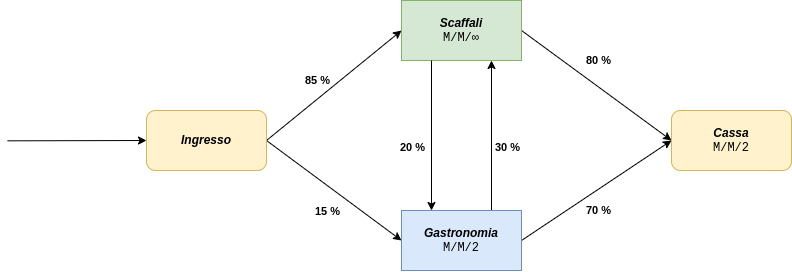
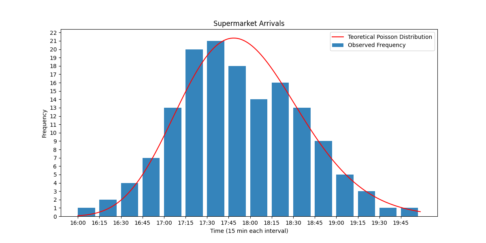

# **Supermarket Simulator** :cyclone:
## **Indice**
- [Introduzione](#introduzione)
- [Astrazione del modello](#astrazione-del-modello)
- [Raccolta dei dati](#raccolta-dati-ledger)
    - [Parametri generali del Sistema](#parametri-generali-del-sistema-slot_machine)
    - [Convalida della distribuzione Teorica](#convalida-della-distribuzione-teorica-round_pushpin)
- [Analisi matematica del Modello](#)
- [Codifica del modello](#)
- [Simulazione](#)
    - [Analisi della Simulazione](#)
    - [Convalida della Simulazione](#)
- [Proposte di miglioramento del modello](#)
    - [Simulazione e Analisi](#)
- [Conclusioni](#)

### **Introduzione**
Questo progetto consiste in uno studio relativo ad un supermercato locale :convenience_store:: verranno definiti e analizzati i dati iniziali del problema estratti da osservazioni reali, per poi applicarli ad un modello di simulazione sviluppato in Python. Infine verranno illustrate alcune possibili soluzioni per il miglioramento delle performance generali del problema proposto.

L’ambiente verrà programmato per simulare le operazioni quotidiane del supermercato e dei relativi clienti. Perciò l’ambiente rispecchierà la conformazione dei locali e il processo attraverso il quale un cliente entra nel negozio, preleva i prodotti, paga alla cassa i prodotti prelevati e infine esce dal negozio.

## **Astrazione del Modello** :pencil2:
Per prima cosa è necessario definere un'astrazione del sistema da analizzare, in modo da poterla utilizzare per gli studi analitici da eseguire. È opportuno scegliere un livello di astrazione idoneo in quanto un livello di astrazione troppo specifico può rendere molto difficoltoso lo svolgimento dei successivi sviluppi e test del simulatore, mentre un livello di astrazione poco approfondito potrebbe portare ad ottenere dei risultati non coerenti al modello reale.  
Il sistema analizzato può essere rappresentato tramite un modello ad eventi discreti di tipo aperto, con spazio degli stati discreto. In particolare, una persona (cliente) che si reca nel supermercato può farlo per una o più delle seguenti ragioni:
- Acquisto di beni nel reparto degli scaffali
- Acquisto di beni nel reparto gastronomia

Una volta presi i beni di interesse, il cliente deve recarsi alla cassa per pagare per poi uscire dal supermercato.

Il sistema può quindi essere rappresentato con 3 nodi:
- **Reparto degli scaffali**: il numero di serventi per questo reparto può essere ipotizzato essere $\infty$ in quando non vi è un limite teorico al numero di clienti che possono contemporaneamente trovarsi in questo nodo. Il limiti nell'atto pratico esiste ed è dovuto a limitazioni fisiche ma, per semplificazione verrà considerato un numero di serventi pari a $\infty$
- **Reparto Gastronomia**: il numero di serventi in questo reparto è pari a 2 in quanto ci sono 2 operatori a disposizione dei clienti che servono secondo un ordine FIFO
- **Cassa**: il numero di serventi in questo reparto è pari a 2 in quanto il supermercato ha due commessi a disposizione per le casse adibite al pagamento dei beni acquistati da parte dei clienti.

Risulta necessario conoscere i tempi di servizio, la distribuzione degli arrivi al supermercato e il relativo utilizzo dei nodi da parte degli utenti. Ulteriori informazioni sulla raccolta dati e sui tempi di servizio del sistema, essi sono disponibili nella sezione [Raccolta Dati](#raccolta-dati-ledger).

Per conoscere la probabilità di ogni cliente di essere interessato ad usufruire di un determinato servizio all'ingresso del supermercato e la probabilità di ogni cliente di essere interessato ad usufruire di un secondo servizio una volta aver usufruito di un altro, è stato necessario monitorare il lavoro del supermercato in un giorno di apertura. Qui di seguito è riportato un resoconto che riporta i dati **approssimati** relativi alle informazioni ottenute:
- *Probabilità* che un cliente, all'ingresso nel supermercato, usufruisca del reparto `scaffali`: $85\%$
- *Probabilità* che un cliente, all'ingresso nel supermercato, usufruisca del reparto `gastronomia`: $15\%$
- *Probabilità* che un cliente, una volta aver usufruito del reparto `scaffali`, sia interessato ad usufruire del reparto `gastronomia`: $20\%$
- *Probabilità* che un cliente, una volta aver usufruito del reparto `gastronomia`, sia interessato ad usufruire del reparto `scaffali`: $30\%$

Il sistema può quindi essere rappresentato dal seguente diagramma:  

## **Raccolta Dati** :notebook:
Per adempiere a questo scopo, si è deciso di monitorare inizialmente l'afflusso di persone nel supermecato nei due turni di attività: dalle `9:00` alle `13:00` e dalle `16:00` alle `20:00`. Da una prima osservazione è risultato che il maggior numero di clienti vi è durante l'apertura pomeridiana. Si è così deciso di raccogliere i dati relativi agli ingressi in questo arco temporale (4 ore) in quanto il sistema viene maggiormente utilizzato.

Le 4 ore sono state suddivise in intervalli da 15 minuti l'uno, e qui di seguito è riportato un breve recap relativo alle frequenze osservate:
- Numero totale di persone entrate nel supermercato: 148
- Numero totale intervalli: 16
- Numero minimo di frequenze osservate in un intervallo: 1
- Numero massimo di frequenze osservate in un intervallo: 21

### **Parametri Generali del Sistema** :slot_machine:
Nella fase di raccolta dati sono stati ricavati, dalle osservazioni, anche i Parametri Generali del Sistema.

Il numero medio persone al minuto che arrivano al sistema è circa 0,61 (uno ogni $1,6$ _min_ $\rightarrow$ uno ogni $97,29$ _secondi_), infatti nelle 4 ore prese in esame, sono arrivati 148 clienti. 

I tempi di servizio variano a seconda dell’operazione effettuata e sono riportati qui di seguito:
|    **Reparto**    |**Tempo di Servizio Medio**| **Servienti** |modello di coda|
| -                 | -                         | -             | - |
|  **Gastronomia**  | 3 minuti                  | 1             | $m/m/2$ |
| **Scaffali**      | 15 minuti                 | $\infty$      | $m/m/\infty$
| **Cassa**         | 190 secondi                  | 1             | $m/m/2$ |

### **Convalida della Distribuzione Teorica** :round_pushpin:
A questo punto, è necessario determinare la Distribuzione Teorica corrispondente all'arrivo dei clienti nel supermercato. Per fare ciò, è necessario trovare un'ipotetica distribuzione ed effettuarne la relativa convalida. Qui di seguito sono riportati gli arrivi per ogni intervallo registrato:

|**Lower Bound**|**Upper Bound**|**$f_i$**|
|   -   |   -   | - |
| 16:00 | 16:15 | 1 |
| 16:15 | 16:30 | 2 |
| 16:30 | 16:45 | 4 |
| 16:45 | 17:00 | 7 |
| 17:00 | 17:15 | 13|
| 17:15 | 17:30 | 20|
| 17:30 | 17:45 | 21|
| 17:45 | 18:00 | 18|
| 18:00 | 18:15 | 14|
| 18:15 | 18:30 | 16|
| 18:30 | 18:45 | 13|
| 18:45 | 19:00 | 9 |
| 19:00 | 19:15 | 5 |
| 19:15 | 19:30 | 3 |
| 19:30 | 19:45 | 1 |
| 19:45 | 20:00 | 1 |

Possiamo notare che l’andamento è il seguente:
- Dalle `16:00` alle `17:45` gli arrivi tendono a crescere
- Dalle `17:30` alle `17:45` abbiamo il picco massimo di arrivi
- Dalle `17:45` alle `20:00` gli arrivi tendono a scendere

Successivamente a questa prima analisi si è scelto di passare alla scelta di un'ipotetica distribuzione e alla relativa convalida. Nel file `data_supermarket.xlsx` nella cartella :open_file_folder: `data` è possibile trovare tutte le informazioni a riguardo. Per riassumere brevemente i risultati ottenuti: si è scelto di utilizzare una **Distribuzione di Poisson** ed è stata convalidata utilizzando la tecnica della **Godness of Fit**.

Nel grafico :bar_chart: qui di seguito sono riportati i dati relativi alle frequenze ed è stato tracciato il grafico della corrispettiva **Distribuzione Teorica**:  

## **Analisi Matematica del Modello** :shipit: :pencil:

|**Metrica**|**Valore**|
|   -   |   -   |
| Tempo medio di arrivo $\lambda$|  |
| Tempo medio di servizio $T_s$ |  |
| Tempo medio di interarrivo $\mu$|  |
| Intensità del traffico di sistema $\rho$|  |
| Numero medio di utenti nel sistema $N$|  |
| Numero medio di utenti in coda $W$| |
| Tempo medio di risposta $R$ |  |
| Tempo medio atteso in coda $T_w$|  |
| Utilizzazione $U$|  |

|**Metrica**|**Valore**|
|   -   |   -   |
| Tempo medio di arrivo $\lambda$|  |
| Tempo medio di servizio $T_s$ |  |
| Tempo medio di interarrivo $\mu$|  |
| Intensità del traffico di sistema $\rho$|  |
| Numero medio di utenti nel sistema $N$|  |
| Numero medio di utenti in coda $W$| |
| Tempo medio di risposta $R$ |  |
| Tempo medio atteso in coda $T_w$|  |
| Utilizzazione $U$|  |

|**Metrica**|**Valore**|
|   -   |   -   |
| Tempo medio di arrivo $\lambda$ |  |
| Tempo medio di servizio $T_s$ |  |
| Tempo medio di interarrivo $\mu$ |  |
| Intensità del traffico di sistema $\rho$ |  |
| Numero medio di utenti nel sistema $N$ |  |
| Numero medio di utenti in coda $W$ | |
| Tempo medio di risposta $R$ |  |
| Tempo medio atteso in coda $T_w$ |  |
| Utilizzazione $U$ |  |

## **Codifica del Modello** :computer:

## **Simulazione** :bar_chart:

## **Proposte di miglioramento del modello** :chart_with_upwards_trend:

## **Conclusioni** :end:
