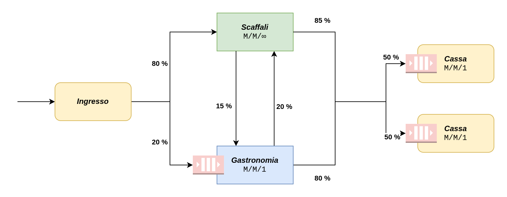
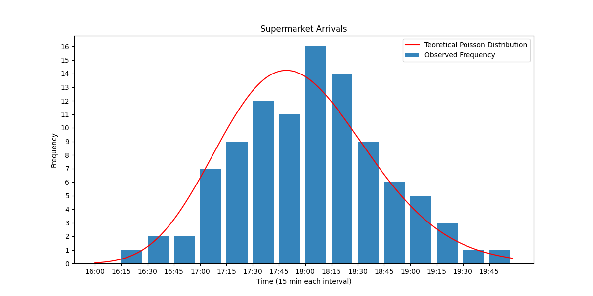
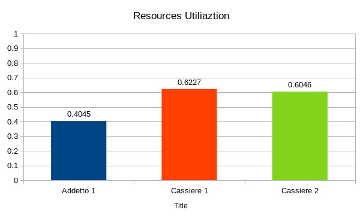
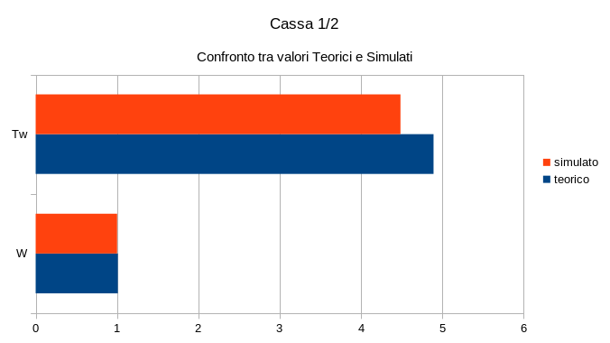
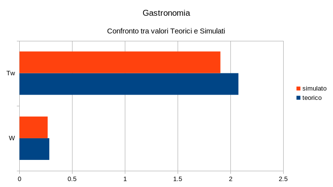
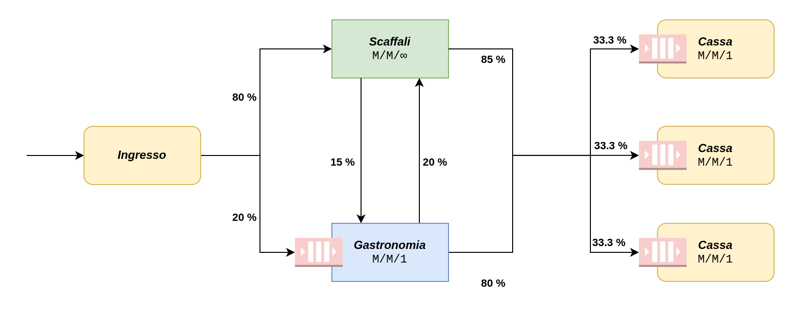

# **Supermarket Simulator** :cyclone:
## **Indice**
- [Introduzione](#introduzione)
- [Astrazione del modello](#astrazione-del-modello)
- [Raccolta dei dati](#raccolta-dati-ledger)
    - [Parametri generali del Sistema](#parametri-generali-del-sistema-slot_machine)
    - [Convalida della distribuzione Teorica](#convalida-della-distribuzione-teorica-round_pushpin)
- [Analisi matematica del Modello](#)
- [Codifica del modello](#)
- [Simulazione](#)
    - [Analisi della Simulazione](#)
    - [Convalida della Simulazione](#)
- [Proposte di miglioramento del modello](#)
    - [Simulazione e Analisi](#)
- [Conclusioni](#)

### **Introduzione**
Questo progetto consiste in uno studio relativo ad un supermercato locale :convenience_store:: verranno definiti e analizzati i dati iniziali e le performance a partire da osservazioni reali. Si passerà poi ad applicarli e convalidarli mediante un modello di simulazione, sviluppato in `Arena Simulation`. Infine verranno illustrate alcune possibili soluzioni per il miglioramento delle performance generali del modello studiato.

L’ambiente verrà programmato per simulare le operazioni quotidiane del supermercato e dei relativi clienti. Perciò l’ambiente rispecchierà la conformazione dei locali e il processo attraverso il quale un cliente entra nel negozio, preleva i prodotti, paga alla cassa i prodotti selezionati e infine esce dal negozio.

## **Astrazione del Modello** :pencil2:
Per prima cosa è necessario definire un'astrazione del sistema da analizzare, in modo da poterla utilizzare per gli studi analitici da eseguire. È opportuno scegliere un livello di astrazione idoneo in quanto un livello di astrazione troppo specifico può rendere molto difficoltoso lo svolgimento dei successivi sviluppi e test del simulatore, mentre un livello di astrazione poco approfondito potrebbe portare ad ottenere dei risultati non coerenti al modello reale.  
Il sistema analizzato può essere rappresentato tramite un modello ad eventi discreti di tipo aperto, con spazio degli stati discreto. In particolare, una persona (cliente) che si reca nel supermercato può farlo per una o più delle seguenti ragioni:
- Acquisto di beni nel reparto degli scaffali
- Acquisto di beni nel reparto gastronomia

Una volta presi i beni di interesse, il cliente deve recarsi alla cassa per pagare per poi uscire dal supermercato.

Il sistema può quindi essere rappresentato con 3 nodi:
- **Reparto degli scaffali**: il numero di serventi per questo reparto può essere ipotizzato essere $\infty$ in quando non vi è un limite teorico al numero di clienti che possono contemporaneamente trovarsi in questo nodo. Il limite nell'atto pratico esiste ed è dovuto a limitazioni fisiche ma, per semplificazione verrà considerato un numero di serventi pari a $\infty$
- **Reparto Gastronomia**: il numero di serventi in questo reparto è pari a 2 in quanto ci sono 2 operatori a disposizione dei clienti che servono secondo un ordine FIFO
- **Cassa**: il numero di serventi in questo reparto è pari a 2 in quanto il supermercato ha due commessi a disposizione per le casse adibite al pagamento dei beni acquistati da parte dei clienti. Tuttavia, ogni cassa ha una propria coda, quindi il modello deve essere mappato come un sistema dato da 2 nodi $M/M/1$.

Risulta necessario conoscere i tempi di servizio, la distribuzione degli arrivi al supermercato e il relativo utilizzo dei nodi da parte degli utenti. Ulteriori informazioni sulla raccolta dati e sui tempi di servizio del sistema, sono disponibili nella sezione [Raccolta Dati](#raccolta-dati-ledger).

Per conoscere la probabilità di ogni cliente di essere interessato ad usufruire di un determinato servizio all'ingresso del supermercato e la probabilità di ogni cliente di essere interessato ad usufruire di un secondo servizio una volta aver usufruito di un altro, è stato necessario monitorare il lavoro del supermercato in un giorno di apertura. Qui di seguito è riportato un resoconto che riporta i dati **approssimati** relativi alle informazioni ottenute:
- *Probabilità* che un cliente, all'ingresso nel supermercato, usufruisca del reparto `scaffali`: $80\%$
- *Probabilità* che un cliente, all'ingresso nel supermercato, usufruisca del reparto `gastronomia`: $20\%$
- *Probabilità* che un cliente, una volta aver usufruito del reparto `scaffali`, sia interessato ad usufruire del reparto `gastronomia`: $15\%$
- *Probabilità* che un cliente, una volta aver usufruito del reparto `gastronomia`, sia interessato ad usufruire del reparto `scaffali`: $20\%$
- Infine i clienti possono scegliere di pagare in una delle due `casse` presenti al supermercato con una *probabilità equamente distribuita* del $50%$

Il sistema può quindi essere rappresentato dal seguente diagramma:  

## **Raccolta Dati** :notebook:
Per adempiere a questo scopo, si è deciso di monitorare inizialmente l'afflusso di persone nel supermercato nei due turni di attività: dalle `9:00` alle `13:00` e dalle `16:00` alle `20:00`. Da una prima osservazione è risultato che il maggior numero di clienti vi è durante l'apertura pomeridiana. Si è così deciso di raccogliere i dati relativi agli ingressi in questo arco temporale (4 ore) in quanto il sistema viene maggiormente utilizzato.

Le 4 ore sono state suddivise in intervalli da 15 minuti l'uno, e qui di seguito è riportato un breve recap relativo alle frequenze osservate:
- Numero totale di persone entrate nel supermercato: 99
- Numero totale intervalli: 16
- Numero minimo di frequenze osservate in un intervallo: 0
- Numero massimo di frequenze osservate in un intervallo: 16

### **Parametri Generali del Sistema** :slot_machine:
Nella fase di raccolta dati sono stati ricavati, dalle osservazioni, anche i Parametri Generali del Sistema.

Il numero medio di persone al minuto che arrivano al sistema è circa 0,61 (uno ogni $2,4$ _min_ $\rightarrow$ uno ogni $97,29$ _secondi_), infatti nelle 4 ore prese in esame, sono arrivati 148 clienti. 

I tempi di servizio variano a seconda dell’operazione effettuata e sono riportati qui di seguito:
|    **Reparto**    |**Tempo di Servizio Medio**| **Servienti** |modello di coda|
| -                 | -                         | -             | - |
|  **Gastronomia**  | 3 minuti                  | 1             | $m/m/1$ |
| **Scaffali**      | 8 minuti                  | $\infty$      | $m/m/\infty$
| **Cassa 1**       | 3 mnuti                   | 1             | $m/m/1$ |
| **Cassa 2**       | 3 mnuti                   | 1             | $m/m/1$ |

### **Convalida della Distribuzione Teorica** :round_pushpin:
A questo punto, è necessario determinare la Distribuzione Teorica corrispondente all'arrivo dei clienti nel supermercato. Per fare ciò, è necessario trovare un'ipotetica distribuzione ed effettuarne la relativa convalida. Qui di seguito sono riportati gli arrivi per ogni intervallo registrato:

|**Lower Bound**|**Upper Bound**|**$f_i$**|
|   -   |   -   | - |
| 16:00 | 16:15 | 0 |
| 16:15 | 16:30 | 1 |
| 16:30 | 16:45 | 2 |
| 16:45 | 17:00 | 2 |
| 17:00 | 17:15 | 7 |
| 17:15 | 17:30 | 9 |
| 17:30 | 17:45 | 12|
| 17:45 | 18:00 | 11|
| 18:00 | 18:15 | 16|
| 18:15 | 18:30 | 14|
| 18:30 | 18:45 | 9 |
| 18:45 | 19:00 | 6 |
| 19:00 | 19:15 | 5 |
| 19:15 | 19:30 | 3 |
| 19:30 | 19:45 | 1 |
| 19:45 | 20:00 | 1 |

Possiamo notare che l’andamento è il seguente:
- Dalle `16:00` alle `17:45` gli arrivi tendono a crescere
- Dalle `18:00` alle `18:15` abbiamo il picco massimo di arrivi
- Dalle `18:15` alle `20:00` gli arrivi tendono a scendere

Successivamente a questa prima analisi si è scelto di passare alla scelta di un'ipotetica distribuzione e alla relativa convalida. Nel file `data_supermarket_GoF.xlsx` nella cartella :open_file_folder: `data` è possibile trovare tutte le informazioni a riguardo. Per riassumere brevemente i risultati ottenuti: si è scelto di utilizzare una **Distribuzione di Poisson** ed è stata convalidata utilizzando la tecnica della **Goodness of Fit**.

Nel grafico :bar_chart: qui di seguito sono riportati i dati relativi alle frequenze ed è stato tracciato il grafico della corrispettiva **Distribuzione Teorica**:  

## **Analisi Matematica del Modello** :shipit: :pencil:

Dalla struttura del modello si può dedurre che si tratta di un sistema a **reti di Jackson**:
*a classe dei modelli a rete di code di **Jackson** è formata da reti aperte, con centri di **servizio esponenziali**, **arrivi Poissoniani** e **topologia probabilistica** arbitraria indipendente dallo stato della rete.*  
Questo perchè vi sono definite delle probabilità per cui un cliente può passare ad un altro nodo dopo averne usufruito di un altro. Ad esempio i clienti hanno una probabilità del $20\%$ di usufruire del `Reparto Scaffali` dopo aver usufruito del `Reparto Gastronomia`.

Per calcolare i parametri dei vari nodi è necessario definire la routing table delle probabilità in quanto la formula da utilizzare per calcolare il parametro $\lambda$, di ogni nodo, è la seguente:
$$\lambda_i = \gamma_i \sum_{j=1}^{M}\lambda_j p_{ji}$$
dove $p_{ij}$ è la `probabilità di andare dal nodo j al nodo i` e $\gamma_i$ è il tasso di arrivo dall'esterno al nodo i.  
La **Routing Table** (o _tabella delle probabilità_) del nostro modello è la seguente:

|**$p_{ij}$**| 1 | 2 | 3 | 4 |
| -          | - | - | - | - |
| **1**      | - | 80% | 20% | - |
| **2**      | - | -   | 15% | 85% |
| **3**      | - | 20% | -   | 80% |
| **4**      | - | - | - | - |

dove:
- 1 = `arrivo`
- 2 = `Reparto Scaffali`
- 3 = `Reparto Gastronomia`
- 4 = `Cassa 1-2` (la probabilità di una singola cassa corrisponde alla metà della probabilità presente nella routing table)

Il parametro generale $\lambda$ per gli arrivi nel supermercato è circa $0,413 min^{-1}.$

Qui di seguito sono riportati i **Parametri Teorici principali**, calcolati dalle osservazioni, per ogni nodo del sistema.

### **Reparto Scaffali** $M/M/\infty$
|**Metrica**|**Valore**|
|   -   |   -   |
| Tempo medio di arrivo $\lambda$ | 0,357 $min^{-1}$ |
| Tempo medio di servizio $T_s$ | 8 $min$ |
| Tempo medio di interarrivo $\mu$ | 0,125 $min^{-1}$ |
| Intensità del traffico di sistema $\rho$ | 2,862 |
| Numero medio di utenti nel sistema $N$ | 2,862 |
| Tempo medio di risposta $R$ | 8 |

### **Reparto Gastronomia** $M/M/1$
|**Metrica**|**Valore**|
|   -   |   -   |
| Tempo medio di arrivo $\lambda$ | 0,136 $min^{-1}$ |
| Tempo medio di servizio $T_s$ | 3 $min$ |
| Tempo medio di interarrivo $\mu$ | 0,333 $min^{-1}$ |
| Intensità del traffico di sistema $\rho$ | 0,408 |
| Numero medio di utenti nel sistema $N$ | 0,691 |
| Numero medio di utenti in coda $W$ | 0,282|
| Tempo medio di risposta $R$ | 5,075 |
| Tempo medio atteso in coda $T_w$ | 2,075 |

### **Cassa** 1-2 $M/M/1$
|**Metrica**|**Valore**|
|   -   |   -   |
| Tempo medio di arrivo $\lambda$ | 0,206 $min^-1$ |
| Tempo medio di servizio $T_s$ | 3 $min$ |
| Tempo medio di interarrivo $\mu$ | 0,333 $min^-1$ |
| Intensità del traffico di sistema $\rho$ | 0,619 |
| Numero medio di utenti nel sistema $N$ | 1,630 |
| Numero medio di utenti in coda $W$ | 1,010 |
| Tempo medio di risposta $R$ | 7,891 |
| Tempo medio atteso in coda $T_w$ | 4,891 |

## **Codifica del Modello** :computer:

Per la codifica del modello abbiamo optato per l'utilizzo del software [Arena Simulation Software](https://www.rockwellautomation.com/en-us/products/software/arena-simulation.html) in quanto, seppur non essendo uno strumento open-source, offre una licenza gratuita per gli studenti e risulta essere uno strumento molto potente (nonostante le limitazioni della licenza free).

Utilizzando il pratico editor per simulatori che offre Arena, tramite un semplice *drag-n-drop si*amo riusciti a modellare il simulatore come segue:

- **Modulo _"Create"_ (`Ingresso`):** è il modulo che si occupa di generare gli arrivi dei clienti al supermercato con i seguenti parametri:
  - `type`: `Random(EXPO)`
  - `Value`: `2.42`
  - `Units`: `Minutes`
  - tutti gli altri sono inalterati
- **Modulo _"Decide"_:** permette ai clienti di scegliere se recarsi al reparto _Scaffali_, con l'80% di probabilità, o alla _Gastronomia_, con il restante 20% di probabilità. Ha i seguenti parametri:
  - `type`: `2-way Chance`
  - `Percent True`: `80`
- **Modulo _"Process"_ (`Scaffali`):** rappresenta gli scaffali del supermercato, si suppone non esserci coda e un _Cliente_ in media trascorre qui _8 minuti_. È stato realizzato con i parametri:
  - `type`: `Standard` 
  - `Action`: `Delay` 
  - `Delay Type`: `Expression` 
  - `Units`: `Minutes`
  - `Allocation`: `Value Added` 
  - `Expression`: `EXPO(8)` 
- **Modulo _"Process"_ (`Gastronomia`):** rappresenta il reparto gastronomia, con al suo interno un solo addetto responsabile di servire i Clienti, che, in media, vengono serviti in _3 minuti_. Il modulo ha i seguenti parametri:
  - `type`: `Standard` 
  - `Action`: `Seize Delay Release`
  - `Priority`: `Medium(2)`
  - `Resources`:
    - `Resource, Addetto, 1` 
  - `Delay Type`: `Expression` 
  - `Units`: `Minutes`
  - `Allocation`: `Value Added` 
  - `Expression`: `EXPO(3)` 
- **Modulo _"Decide"_:** questo modulo permette ai _Clienti_ di poter scegliere se muoversi dal reparto _Scaffali_ alle _Casse_, con una probabilità dell'85%, o di dirigersi verso la _Gastronomia_, con il restante 10%. Ha i seguenti parametri: 
  - `type`: `2-way Chance`
  - `Percent True`: `85`
- **Modulo _"Decide"_:** questo permette ai Clienti di poter muoversi dalla Gastronomia alle Casse, con l'80% di probabilità, o verso gli Scaffali, con il restante 20%. È composto dai seguenti parametri:
  - `type`: `2-way Chance`
  - `Percent True`: `80`
- **Modulo _"Decide"_:** questa ultima scelta permette al _Cliente_ di decidere in quale _Cassa_ pagare. La probabilità di scelta è equamente distribuita tra le casse con il 50%. Comprende i parametri:
  - `type`: `2-way Chance`
  - `Percent True`: `50`
- **Modulo _"Process"_ (`Cassa 1`):** questo nodo rappresenta la prima _Cassa_ del supermercato in cui i Clienti possono pagare. È realizzata con i seguenti parametri:
  - `type`: `Standard` 
  - `Action`: `Seize Delay Release`
  - `Priority`: `Medium(2)`
  - `Resources`:
    - `Resource, Cassiere, 1` 
  - `Delay Type`: `Expression` 
  - `Units`: `Minutes`
  - `Allocation`: `Value Added` 
  - `Expression`: `EXPO(3)` 
- **Modulo _"Process"_ (`Cassa 2`):** questo nodo rappresenta la seconda _Cassa_ del supermercato in cui i Clienti possono pagare. È realizzata con i seguenti parametri:
  - `type`: `Standard` 
  - `Action`: `Seize Delay Release`
  - `Priority`: `Medium(2)`
  - `Resources`:
    - `Resource, Cassiere, 1` 
  - `Delay Type`: `Expression` 
  - `Units`: `Minutes`
  - `Allocation`: `Value Added` 
  - `Expression`: `EXPO(3)` 
- **Modulo _"Dispose"_ (`Uscita`):** è il nodo finale che modella l'uscita del supermercato.

## **Simulazione** :bar_chart:

Una volta completata la codifica del modello, abbiamo selezionato i parametri di configuarazione per seguire il modello di convalida basato sul _Metodo delle Prove Ripetute_:

- `Number of Replication`: `100`
- `Warmup Period`: `60` - `Time Units`: `Minutes` (necessario a stabilizzare il simulatore)
- `Replication Length`: `1` - `Time Units`: `Days`
- `Hours per Day`: `5`
- `Base Time Units`: `Minutes`

Con questa configurazione possiamo simulare le 4 ore pomeridiane di lavoro del supermercato che abbiamo monitorato nella fase iniziale, per diversi giorni lavorativi.

Il report completo della simulazione può essere consultato tramite il file FILE mentre, qui di seguito sono riportati e analizzati i risultati principali:

- **System**
  Indica il numero di utenti processati in media dal sistema. Possiamo notare che rispetta perfettamente il numero di frequenze totali raccolte dalle osservazioni.

  |Metrica|Average|
  | -----| ----- |
  |Number Out | 99|
  |**Waiting Time**   Tempo medio di attesa di   un utente nel sistema| 5.1339|
  |**Total Time**   Tempo medio speso da   un utente nel sistema| 15.9064|

- **Cassa 1**
  |Metrica|Average|Half Width| Teorico|
  | -----| ----- | ------| -|
  |$T_w$ (Average Waiting Time)| 4.4847|0.60| 4.8913|
  |$W$ (Average Number of Clients Waiting)| 1.0013|0.16| 1.0106|
  |$\rho$ (Resource Utilization)| 0.6227| 0.02| 0.6198|

- **Cassa 2**
  |Metrica|Average|Half Width| Teorico|
  | -----| ----- | ------| - |
  |$T_w$ (Average Waiting Time)| 4.3785|0.65| 4.8913|
  |$W$ (Average Number of Clients Waiting)| 0.93397|0.16| 1.0106|
  |$\rho$ (Resource Utilization)| 0.6046| 0.02| 0.6198|

- **Gastronomia**
  |Metrica|Average|Half Width| Teorico|
  | -----| ----- | ------| -|
  |$T_w$ (Average Waiting Time)| 1.9050|0.28| 2.0758|
  |$W$ (Average Number of Clients Waiting)| 0.2674|0.04| 0.2829|
  |$\rho$ (Resource Utilization)| 0.4045| 0.02| 0.4089|

- **Grafici** :bar_chart::
  - **Utilizzo delle risorse**  
  - **Cassa Teorico Vs Simulato**  
  - **Gastronomia Teorico Vs Simulato**  
   
## **Proposte di miglioramento del modello** :chart_with_upwards_trend:
Possiamo notare come il modello rispetta già quelli che potrebbero essere dei limiti di attesa per i clienti, in quanto il tempo totale medio speso da un utente nel supermercato è di circa `15,9064 min` con soli `5,1339 min` di attesa.  
Per mostrare le variazioni delle performance del sistema abbiamo comunque deciso di effettuare una nuova simulazione aggiungendo una nuova cassa. Il modello studiato presenta le stesse caratteristiche del precedente tranne per i nodi relativi alla cassa che passano da 2 $M/M/1$ a 3 $M/M/1$. 
Il nuovo modello viene così rappresentato:

I parametri teorici sono i seguenti:
- **Cassa** 1-2-3 $M/M/1$
  |**Metrica**|**Valore**|
  |   -   |   -   |
  | Tempo medio di arrivo $\lambda$ | 0.137 $min^-1$ |
  | Tempo medio di servizio $T_s$ | 3 $min$ |
  | Tempo medio di interarrivo $\mu$ | 0,333 $min^-1$ |
  | Intensità del traffico di sistema $\rho$ | 0.413 |
  | Numero medio di utenti nel sistema $N$ | 0.704 |
  | Numero medio di utenti in coda $W$ | 0.291 |
  | Tempo medio di risposta $R$ | 5.112 |
  | Tempo medio atteso in coda $T_w$ | 2.112 |

I risultati ottenuti dalle simulazioni sono i seguenti:
- **System**
  Possiamo notare come il miglioramento delle prestazioni del sistema è minimo, in quanto si abbassa in media di circa soli $2 min$.

  |Metrica|Average|
  | -----| ----- |
  |Number Out | 99|
  |**Waiting Time**   Tempo medio di attesa di   un utente nel sistema| 2.8283|
  |**Total Time**   Tempo medio speso da   un utente nel sistema| 13,8056|

- **Cassa 1**
  |Metrica|Average|Half Width| Teorico|
  | -----| ----- | ------| -|
  |$T_w$ (Average Waiting Time)| 2.1168|0.34| 2.1126 |
  |$W$ (Average Number of Clients Waiting)| 0.3011|0.06| 0.2910|
  |$\rho$ (Resource Utilization)| 0.4128| 0.02| 0.4132|

- **Cassa 2**
  |Metrica|Average|Half Width|Teorico|
  | -----| ----- | ------|-|
  |$T_w$ (Average Waiting Time)| 2.3086|0.41| 2.1126 |
  |$W$ (Average Number of Clients Waiting)| 0.3537|0.07| 0.2910|
  |$\rho$ (Resource Utilization)| 0.425| 0.02| 0.4132|

- **Cassa 3**
  |Metrica|Average|Half Width|Teorico|
  | -----| ----- | ------|-|
  |$T_w$ (Average Waiting Time)| 1.7880|0.25| 2.1126 |
  |$W$ (Average Number of Clients Waiting)| 0.2619|0.04| 0.2910|
  |$\rho$ (Resource Utilization)| 0.4090| 0.02| 0.4132|

## **Conclusioni** :end:
In conclusione, è stato dimostrato come è possibile utilizzare la teoria della simulazione per un'applicazione reale. In questo caso specifico, il sistema analazzito presenta già una buona configurazione (in quanto si tratta di una nota catena). Tuttavia, abbiamo mostrato quelle che potrebbero essere le variazioni di performance nel caso in cui venga aggiunta una nuova cassa. 